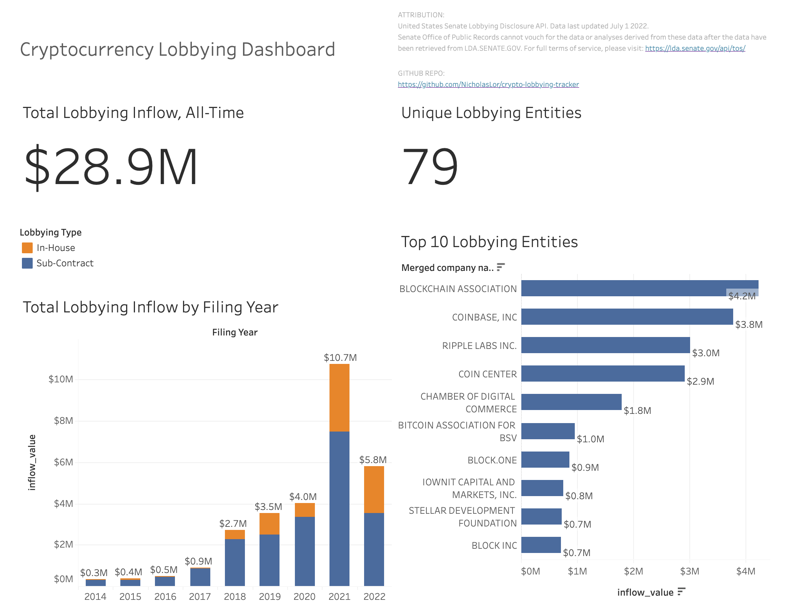

# :us: Crypto Lobbying Tracker :us:

Click [here](https://public.tableau.com/views/CryptoLobbyingDashboard/SummaryDashboard?:language=en-US&:display_count=n&:origin=viz_share_link) to view the Public Tableau Dashboard

### **Introduction** ###
Crypto Lobbying Tracker connects US bill data and lobbying disclosure reports related to cryptocurrency to illustrate the industries effort to influence its own regulatory future.

This is a continuation of my final project from the UofC Software Engineering Course ENSF 592- Programming Fundamentals for Data Scientists.

 

### **Current State** ###

 

### **Release Summary** ###
v0.1 - 7/22/2022 - Initial Release on Tableau Public  
v0.2 - planned - Integration of Legislative Data using Legiscan API  
v0.3 - planned - Fully Automate and warehouse data with PostgresSQL, Docker and Cron  
v0.4 - planned - Self-host using an open source dashboarding software such as Metabase  
   

### **Release Details** ###
v0.1: Initial Release on Tableau Public

For this first release, I wanted to make a proof-of-concept to build and further iterate on. I wrote a python script to extract data from the Senate Lobbying API, and completed basic data cleansing and validation tasks using excel. Then I published the dashboard to Tableau as an extract.  

 

### **Attribution** ###
United States Senate Lobbying Disclosure API. Last Queried: July 1 2022.
https://lda.senate.gov/api/

NOTICE: 
Senate Office of Public Records cannot vouch for the data or analyses derived from these data after the data have been retrieved from LDA.SENATE.GOV. For full terms of service, please visit: https://lda.senate.gov/api/tos/

