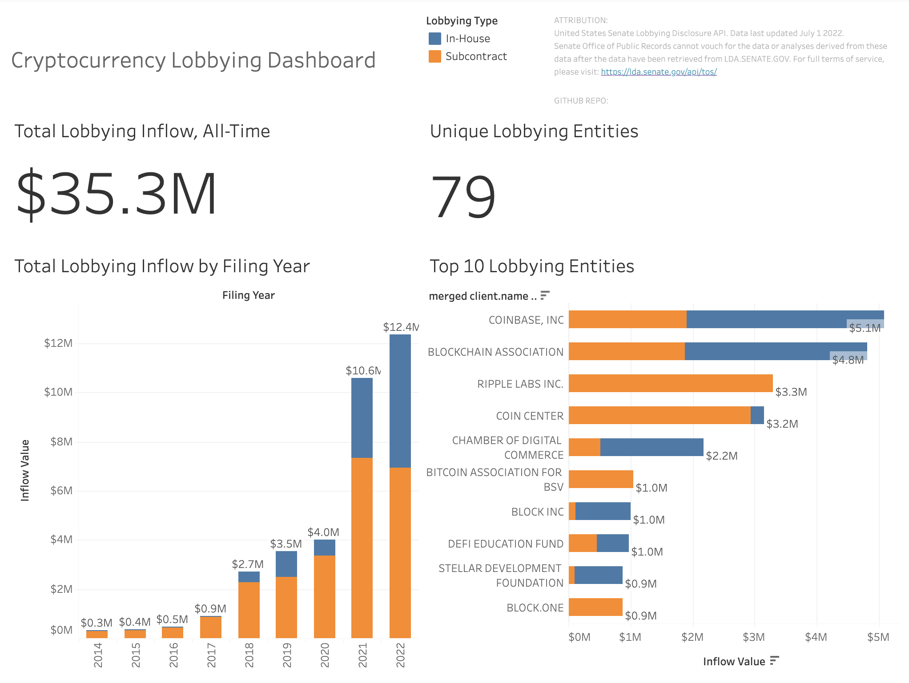

# :zap: US Cryptocurrency Lobbying Tracker :zap:

Click [here](https://public.tableau.com/views/CryptocurrencyLobbyingDashboard/SummaryDashboard?:language=en-US&:display_count=n&:origin=viz_share_link) to view the Public Tableau Dashboard

Click [here](https://medium.com/@bobbylor00/inside-the-crypto-industrys-efforts-to-ramp-up-government-lobbying-a-data-project-pt-1-e2f365e1a200) to read my Medium article about my first peer over the data.

### **Introduction** ###
Crypto Lobbying Tracker connects US bill data and lobbying disclosure reports related to cryptocurrency to illustrate the industries effort to influence its own regulatory future.

This is a continuation of my final project from the UofC Software Engineering Course ENSF 592- Programming Fundamentals for Data Scientists.

 

### **Current State** ###

 

### **Release Summary** ###
:white_check_mark: - v0.1 - 7/22/2022 - Initial Release on Tableau Public  
:white_check_mark: - v0.2 - 8/30/2022 - Fully Automate and warehouse data with PostgresSQL  
:soon: - v0.3 - planned - Integration of Legislative Data using Legiscan API  
:soon: - v0.4 - planned - Self-host using an open source dashboarding software such as Metabase  
   

### **Release Details** ###
v0.1: Initial Release on Tableau Public

- For this first release, I wanted to make a proof-of-concept to build and further iterate on. I wrote a python script to extract data from the Senate Lobbying API, and completed basic data cleansing and validation tasks using excel. Then I published the dashboard to Tableau as an extract.
   

v0.2: Fully Automate and warehouse data with PostgresSQL

- For this second release, I automated all of the data cleansing I previously had to do manually excel by utilizing the pandas libray in python to create the additional columns. Then I spun up a local postgres database and configured my python script to import into it.

 

### **Caveats and Notes** ###
- This dashboard tracks "pure" cryptocurrency companies only. Companies like Meta lobby the US government on a wide variety of issues, including cryptocurrency/metaverse legislation, but do not specify how much spend is allocated to specific issues. Therefore, I am filtering out companies like Meta and only including those who purely operate in the crypto/web3 space (think Coinbase, Block, etc).

 

### **Attribution** ###
United States Senate Lobbying Disclosure API. Last Queried: July 1 2022.
https://lda.senate.gov/api/

NOTICE: 
Senate Office of Public Records cannot vouch for the data or analyses derived from these data after the data have been retrieved from LDA.SENATE.GOV. For full terms of service, please visit: https://lda.senate.gov/api/tos/

